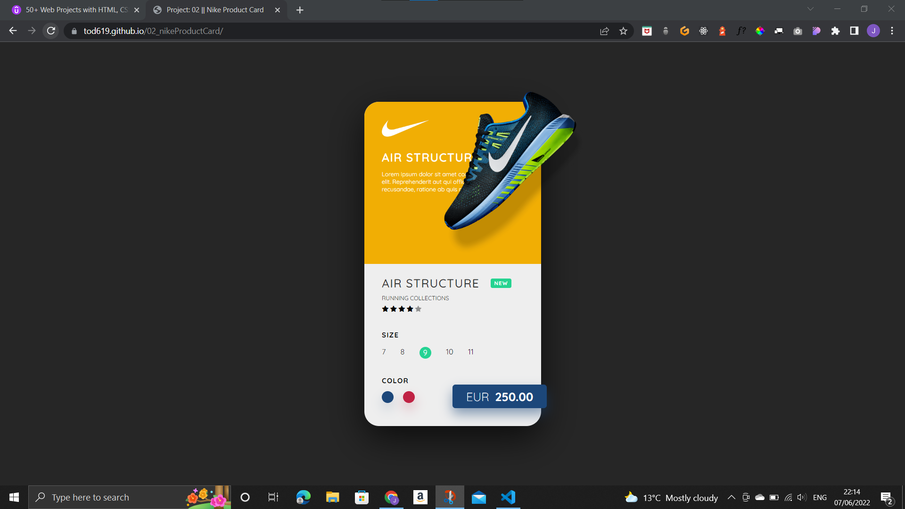
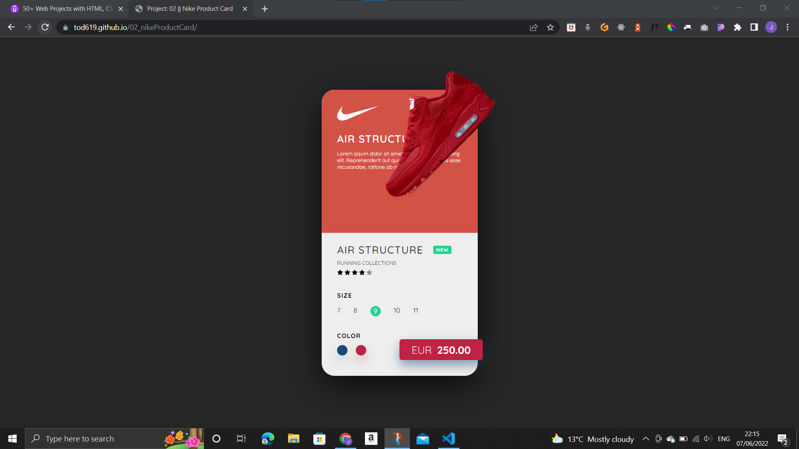

# 02_nikeProductCard

## Description

These projects are all part of 50 different smaller practice projects that I plan to complete over the comming weeks to proactice HTML, CSS, and JavaScript. They will be small in scope but will help me refresh differen aspects of front end developement. This is the second project an example of a product card used by Nike.  
This product card shows an example of a trainer created by Nike. The card shows a picture of the trainer along with a description, star ratting, price, and color selection.

When the user clicks on the colored circles it changes the theme color of the card. Evertyhing changes with an animated transition as can be seen in the second screenshot.

## Demo

A demo of the project can be found here: https://tod619.github.io/02_nikeProductCard/
